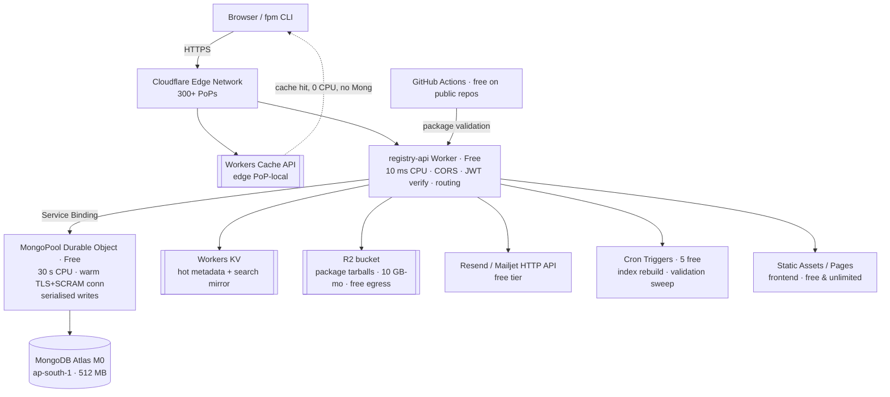

# Serverless Migration Plan — fpm Registry API → $0 Edge Architecture

> **Status:** Approved for execution · **Author:** migration-architect · **Date:** 2026-10-02
> **Target:** 100% free-tier hosting. No credit card. No paid plan, ever.

---

## 1. Verified Constraints (measured, not assumed)

Every number below was confirmed against vendor docs or **measured on this machine** against the
live cluster. Sources are cited in [§10](#10-sources).

### 1.1 Cloudflare Workers — Free plan

| Feature | Free limit | Design impact |
|---|---|---|
| Requests | **100,000 / day** | Fine — fpm registry is a low-traffic registry |
| **CPU time per invocation** | **10 ms** | ⚠️ **The binding constraint of the whole project** |
| Memory | 128 MB | Tarballs must **never** be buffered in memory |
| Subrequests | 50 / invocation | Batch Mongo queries; use `$lookup` over N round-trips |
| Worker size | 64 MiB | Measured bundle: **1.85 MiB** — plenty of headroom |
| Workers | 100 / account | Split into a few purpose-built workers |
| Cron Triggers | 5 / account | 5 is exactly enough for the async jobs we need |

Cloudflare's own guidance: *"The average Worker uses approximately 2.2 ms per request."* Exceeding
CPU returns **Error 1102** and kills the invocation. Note isolates get *"some built-in flexibility"*
for *infrequent* overruns — not something to design around.

### 1.2 Cloudflare companion products — Free

| Product | Free limits | Role in this architecture |
|---|---|---|
| **Durable Objects** | 100k req/day, 13,000 GB-s/day, 5 GB storage, **30 s CPU/request** | 🔑 **MongoDB connection pool + write serialiser** |
| **R2** | 10 GB-month, 1M Class A ops/mo, 10M Class B ops/mo, **free egress** | Replaces GridFS. All package tarballs |
| **Workers KV** | 100k reads/day, 1k writes/day, 1 GB | Hot metadata cache + search index mirror |
| **D1** | 5M rows read/day, 100k rows written/day, 5 GB | Optional materialised search index |
| **Static Assets** | 20,000 files, 25 MiB each, **asset requests free & unlimited** | Frontend hosting |

**Decisive fact:** *"Developers on the Workers Paid plan [with SQLite DO storage beyond limits] will
incur charges. Developers on the Workers Free plan will not be charged."* Durable Objects are usable
at $0 — and critically, **Durable Objects get 30 s of CPU per request on the Free plan, versus the
Worker's 10 ms.** That 3× difference is what makes the entire design viable.

### 1.3 MongoDB Atlas — Free cluster (`M0`)

| Limit | Value |
|---|---|
| Storage | 512 MB shared |
| Throughput | **100 operations / second** |
| Network | **10 GB in + 10 GB out per rolling 7 days** |

> ⚠️ The 10 GB/7-day **egress** cap is the real constraint. It is why **every tarball byte must live
> in R2, never in MongoDB.** MongoDB carries only metadata; tarballs stream from R2's free egress.

### 1.4 Measured on the live cluster — `cluster0.kdreahb.mongodb.net`

```
Credentials ......... VERIFIED WORKING
Location ............ ap-south-1 (Mumbai) — 159.41.170.x, m0-15-shard
MongoDB server ...... 8.0.34
Databases present ... admin, local, sample_mflix
fpmregistry ......... ***DOES NOT EXIST — cluster is empty of registry data ***
```

**Implication: there is no production data to migrate.** This is a *code + schema* migration, not a
data migration. Phase 0 (data backfill/cutover/reconciliation) is therefore **eliminated entirely** —
a large reduction in risk. `sample_mflix` is the Atlas default sample and is ignored.

### 1.5 Measured CPU cost — the number that decides the architecture

```
PBKDF2-SHA256, 4096 iterations (SCRAM-SHA-256 auth) ......... 4.47 ms CPU
Cold connect + SCRAM auth (wall, this host → ap-south-1) .. ~2,700 ms
Warm find() on an established connection (wall) ........... ~240 ms
mongodb driver v7.7.0 bundled into workerd ............... 1.85 MiB / 240 KiB gzip  ✅
```

**This is the crux.** A single `PBKDF2-SHA256` — one step of MongoDB's SCRAM handshake — burns
**4.47 ms of the Worker's 10 ms budget.** Add TLS 1.3 handshake (X25519 + AES-GCM), BSON codec
warm-up and driver init, and a **cold** MongoDB connection reliably exceeds 10 ms → **Error 1102**.

> **Therefore: a Cloudflare Worker must never open a MongoDB connection inside a request handler.**
> The connection must be established once, inside a Durable Object (30 s CPU), and reused.

---

## 2. Options Considered and Rejected

| # | Option | Verdict | Why |
|---|---|---|---|
| 1 | Keep Flask on a free PaaS (Render/Railway/Fly) | ❌ | Not edge, not serverless, cold starts, free tiers revoked or credit-based. Violates the brief. |
| 2 | Worker + MongoDB Data API over HTTPS | ❌ | **Atlas App Services / Data API reached EOL 30 Sep 2025.** Gone. |
| 3 | Worker + **cold** MongoDB driver per request | ❌ | 4.47 ms SCRAM alone ≈ half the CPU budget. Exceeds 10 ms → Error 1102. |
| 4 | Cloudflare Containers for the Python backend | ❌ | Paid-only. Breaks the $0 constraint. |
| 5 | D1 / Postgres / SQLite instead of MongoDB | ❌ | Technically fine and free, but discards the required datastore. Rejected by brief. |
| 6 | **Worker + Durable Object connection pool + MongoDB M0 + R2** | ✅ **CHOSEN** | Genuinely $0, genuinely edge, keeps MongoDB, fits CPU budget. |

---

## 3. Target Architecture



### Request lifecycle (hot read — the common case)

1. Edge checks **Cache API** (PoP-local). Hit → returned instantly, **zero Worker CPU**, zero Mongo.
2. Miss → `registry-api` Worker runs. Verifies JWT (HS256 via WebCrypto), builds the query.
3. Routes through a **Service Binding** to the `MongoPool` Durable Object.
4. DO reuses its warm, already-authenticated MongoDB connection → **~1–2 ms CPU** for BSON
   encode/decode. Query runs. Response streams back.
5. Worker writes the response into Cache API with an explicit TTL.

### Request lifecycle (tarball download — the bandwidth path)

Browser hits `/download/...` → Worker returns a **short-lived signed R2 URL**. The tarball then flows
**R2 → browser directly on free egress**. It never touches Worker memory (128 MB limit), never
touches MongoDB (10 GB/7-day egress cap), and costs **$0.00**.

---

## 4. Service Mapping — Flask → Workers

| Flask module | LoC | → Destination | Notes |
|---|---|---|---|
| `app.py` | 18 | Worker entry | JWT config → Worker secret; CORS → allowlist |
| `server.py` | 33 | Worker entry | Route table; 404/500 handlers |
| `mongo.py` | 50 | `db/client.ts` + R2 | GridFS → R2; `/registry/archives` → R2 list |
| `auth.py` | 364 | `routes/auth.ts` | SMTP → HTTP email; hashing → WebCrypto |
| `user.py` | 742 | `routes/users.ts` | Largest surface |
| `packages.py` | 1102 | `routes/packages.ts` + search | Core domain |
| `namespaces.py` | 244 | `routes/namespaces.ts` | |
| `validate.py` | 168 | `validate/` + GitHub Actions | **docker spawn removed** |
| `check_digests.py` | 87 | Cron Trigger | |
| `generate_tarball.py` | 31 | `build/tarball.ts` | |
| `models/*.py` | 232 | `models/*.ts` | Plain TS types, `toJson`/`fromJson` ports |
| `documentation/*.yaml` | 33 files | Static OpenAPI 3.1 | Served at `/apidocs/openapi.json` |
| `tests/*.py` | ~1,050 | Vitest + `@cloudflare/vitest-pool-workers` | Same scenarios |

---

## 5. Incompatibility Resolutions

Every one of these is a hard blocker that must be *solved*, not worked around.

| Blocker | Current | Resolution | Cost |
|---|---|---|---|
| **GridFS tarballs** | MongoDB GridFS, unbounded | **Cloudflare R2**, signed URLs, `Content-Disposition` | $0 (10 GB-mo, free egress) |
| **Docker package validation** | `docker` SDK spawns a container per upload | **GitHub Actions** workflow validates and POSTs the verdict back (free on public repos). Worker queues a stub + `unable_to_verify` immediately | $0 |
| **Gmail SMTP** | `smtplib` on port 587, connects **at import time** | **HTTPS email API** — Resend (3k/mo) / Mailjet (6k/mo, 200/day) / Brevo (300/day) | $0 |
| **Password hashing** | `sha256(password + static SALT)` — weak | **PBKDF2-SHA256, 210k iters via WebCrypto** for new passwords; legacy SHA-256 still **verified** so no user is locked out; transparent rehash on next login | $0 |
| **JWT** | `flask-jwt-extended`, **hardcoded secret** in `app.py` | **HS256 verify via WebCrypto** — byte-compatible, so existing tokens and frontend code keep working. Secret → Worker secret | $0 |
| **flasgger / Swagger UI** | Server-rendered at runtime | Static **OpenAPI 3.1** JSON + a prebuilt UI at `/apidocs`. Cheaper and cacheable | $0 |
| **Open CORS** | `CORS(app)` — allows everything | Explicit origin allowlist from Worker env | $0 |
| **`os.listdir("static")`** | Reads container filesystem | R2 `list()` | $0 |
| **100 ops/sec Mongo cap** | Unbounded today | `$lookup` aggregation to collapse round-trips; KV + Cache to absorb repeats | $0 |

---

## 6. Execution Phases

Each phase is a separate PR, independently deployable and independently revertible. The
`migration-architect` gate applies: **no phase ships without a passing compatibility check and a
tested rollback.**

| Phase | Scope | Validation gate | Rollback |
|---|---|---|---|
| **0** | Baseline: freeze API contract from `docs/API.md` + 33 swagger files into an executable OpenAPI 3.1 spec + golden contract tests | Contract test suite green against the *current* Flask app | N/A (no behaviour change) |
| **1** | Worker skeleton: `wrangler.jsonc`, routing, CORS allowlist, health, 404/500 parity | Vitest + parity diff vs Phase 0 spec | Revert deploy |
| **2** | `MongoPool` Durable Object: `globalThis` singleton, lazy TLS+SCRAM handshake, `try/finally` close, reconnect + backoff, connection health | **CPU probe**: warm request must stay < 10 ms Worker CPU | Disable binding → Worker returns 503 |
| **3** | Auth routes (`login`, `signup`, `logout`, JWT, `forgot/reset-password`, `verify-email`, `change-email`) | Phase 0 auth contract tests pass verbatim | Feature-flag to legacy |
| **4** | Namespaces + users routes | Contract tests | Feature-flag |
| **5** | Packages routes (read) + Cache API layer | Contract tests + cache-hit ratio ≥ 80 % | Bypass cache |
| **6** | Package upload → **R2**, signed-URL download | Upload/download round-trip + digest verify | R2 → GridFS shim |
| **7** | Search (KV/D1 materialised index) + Cron rebuild | Search parity vs Mongo `$regex`/`$text` | Serve Mongo search |
| **8** | Validation pipeline → GitHub Actions; `check_digests` → Cron | End-to-end validation of a real tarball | Legacy sync validator |
| **9** | Email provider swap; OpenAPI docs; hardening; perf pass | Full suite + perf budget | Revert |
| **10** | **Canary → cutover**: 10 % → 50 % → 100 % traffic at Cloudflare | Error rate + p95 within SLO for 72 h | **DNS/worker flip back to legacy — under 60 s** |

### Traffic cutover (Strangler Fig, per `migration-architect`)

```mermaid
graph LR
    A[Legacy Flask] -.phase 10.-> B[Legacy Flask]
    C[Edge Worker] -.phase 10->|10%| D[canary]
    C -.->|100%| E[cutover]
```

---

## 7. Free-Tier Budget

| Resource | Free allowance | Design headroom |
|---|---|---|
| Worker requests | 100,000 / day | Cache-first target: >80 % served at edge → Mongo sees < 20 k/day |
| Worker CPU | 10 ms / invocation | DO offloads handshake; per-request budget **< 3 ms** |
| DO requests | 100,000 / day | One hop per cache-missing request |
| DO CPU | 30 s / request | Handshake (~5 ms) amortised over isolate lifetime |
| KV | 100k reads / 1k writes per day, 1 GB | Metadata only, never tarballs |
| R2 | 10 GB-month, free egress | ~10,000 typical fpm tarballs |
| Mongo | 100 ops/sec, 10 GB/7-day egress | Metadata only; `$lookup` to cut ops |
| Static assets | free & unlimited | Frontend |
| Cron | 5 triggers | Index rebuild, digest sweep, cache warm, cleanup, health |

**Monthly cost: $0.00.** Failure mode if a cap is hit: requests error (Cloudflare returns a clear
error); it never silently bills.

---

## 8. Optimisations & Allowed API Improvements

Contract-preserving first. Anything that changes an observable response is additive-only.

1. **Collapse round-trips** — `$lookup` instead of N queries; targets the 100 ops/sec cap.
2. **Edge caching** with explicit per-route TTLs; `stale-while-revalidate` for package pages.
3. **Projections** — never select `password` hashes; shrink BSON to cut CPU.
4. **Add `ETag` + `If-None-Match`** → `304`s, which cost ~0 CPU.
5. **`Cache-Control` + `stale-while-revalidate`** on the frontend.
6. **Pagination + `projection`** on list endpoints (bounded results).
7. **Versioned envelope** — additive `meta` block; legacy fields untouched.
8. **Indexed-only search** over KV/D1 rather than collection scans.
9. **Streaming R2 uploads** — never buffer a tarball in the 128 MB Worker.
10. **Gzip/Brotli** at the edge; JSON responses are highly compressible.

---

## 9. Risks & Mitigations

| Risk | Likelihood | Impact | Mitigation |
|---|---|---|---|
| DO connection dies mid-flight | Medium | Medium | Lazy reconnect + exponential backoff; idempotent retry on `NotPrimary`; health-check on boot |
| 10 ms CPU overrun → Error 1102 | Medium | High | All heavy work in DO; aggressive caching; streaming; **CPU probe in CI** |
| Mongo 10 GB/7-day egress cap | Medium | Medium | **All tarballs in R2**; monitor `networkMetrics` |
| R2 10 GB cap | Low | Medium | Lifecycle rule expiring superseded tarballs |
| Password-hash migration locks users out | Low | **High** | Dual-verify (PBKDF2 ∨ legacy SHA-256); rehash on login; never rewrite pre-migration hashes |
| Email provider quota (100–200/day) | Medium | Low | Brevo 300/day as fallback; queue + retry |
| Rate abuse on a $0 tier | High | Medium | Cloudflare WAF + per-IP/token rate limiting; tight CPU limit in `wrangler.jsonc` |
| Cluster lost / credentials rotate | Low | **High** | Atlas backups + snapshot schedule; secrets in Cloudflare, never committed |
| Search parity gap (regex → index) | Medium | Medium | Shadow-compare both engines before cutover |
| Frontend/Backend contract drift | Medium | High | **Phase 0 golden contract tests are the gate for every later phase** |

---

## 10. Sources

- Cloudflare Workers [Pricing](https://developers.cloudflare.com/workers/platform/pricing/) · [Limits](https://developers.cloudflare.com/workers/platform/limits/)
- Cloudflare [Durable Objects Pricing](https://developers.cloudflare.com/durable-objects/platform/pricing/) · [Limits](https://developers.cloudflare.com/durable-objects/platform/limits/) · [SQLite storage billing changelog](https://developers.cloudflare.com/changelog/post/2025-12-12-durable-objects-sqlite-storage-billing/)
- Cloudflare [R2 Pricing](https://developers.cloudflare.com/r2/pricing/) · [KV Pricing](https://developers.cloudflare.com/kv/platform/pricing/) · [D1 Pricing](https://developers.cloudflare.com/d1/platform/pricing/)
- Cloudflare [TCP Sockets](https://developers.cloudflare.com/workers/runtime-apis/tcp-sockets/) · [Connecting to databases](https://developers.cloudflare.com/workers/databases/connecting-to-databases/)
- MongoDB [Free cluster limits](https://www.mongodb.com/docs/atlas/reference/free-shared-limitations/) · [App Services deprecation](https://www.mongodb.com/docs/atlas/app-services/deprecation/) · [Data API deprecation](https://www.mongodb.com/docs/atlas/app-services/data-api/data-api-deprecation/)
- Measured in-repo: `mongodb` v7.7.0 driver, live `cluster0.kdreahb.mongodb.net` (8.0.34, ap-south-1)